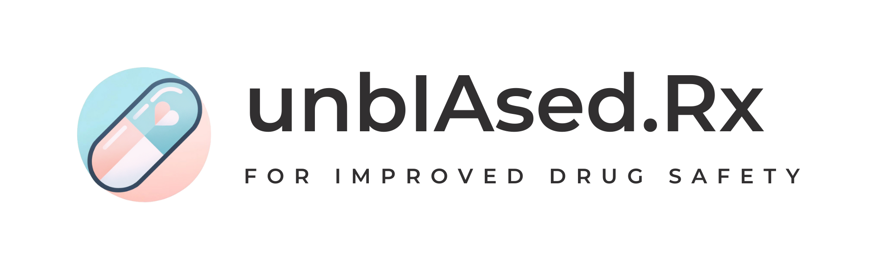

unbIAsed.Rx is an innovative AI-powered platform dedicated to highlighting sex-specific adverse effects of medications.
Our mission is to promote awareness of pharmaceutical disparities, advocate for equitable research practices, and enhance medication safety for everyone.

We're proud to share that we participated in the AI4Good Lab Summer 2024 at Mila and won the Accelerator Award for our work. 

For more information take a look at our website: http://unbiased-rx.com 

For updates follow us on our LinkedIn page: https://www.linkedin.com/company/unbiased-rx/
